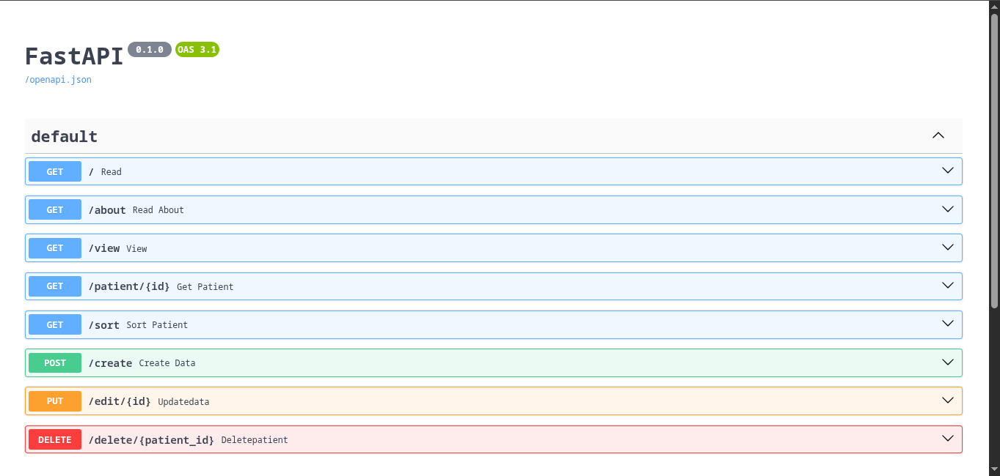
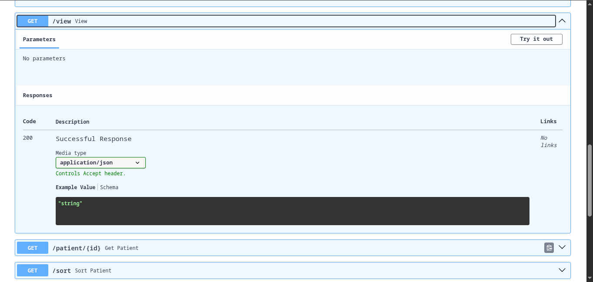
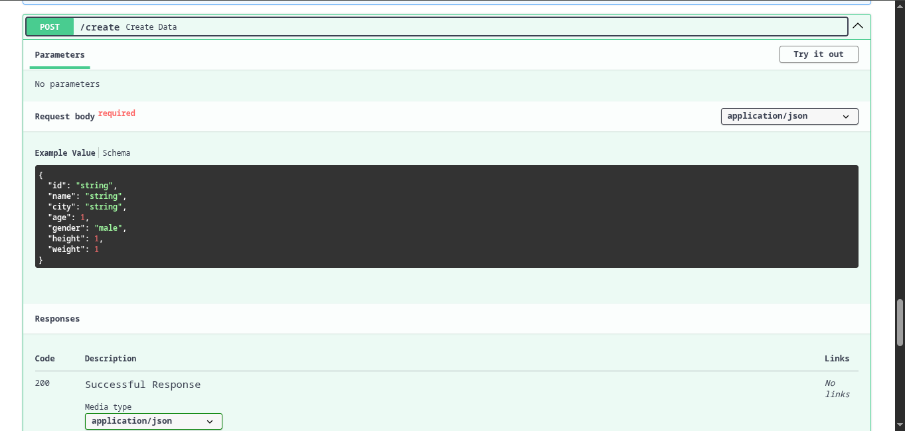
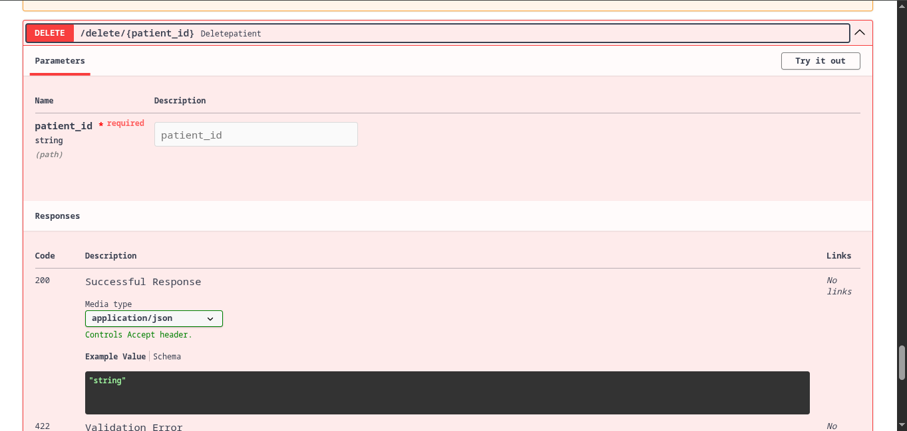

# fastAPI
# 🏥 FastAPI Patient Management API

A beginner-friendly REST API built with **FastAPI** and **Pydantic** to learn backend development, request validation, and CRUD operations.

The project stores patient records in a JSON file and demonstrates how FastAPI and Pydantic work together to build clean, validated APIs.

---

## 🚀 Features

- Create new patient records
- View all patients
- Retrieve a patient by ID
- Update patient details
- Delete patient records
- Sort patients by:
  - Name
  - Age
  - City
- Automatic BMI calculation
- Automatic health verdict generation
- Input validation using Pydantic
- JSON-based data storage

---

## 🛠 Tech Stack

- Python 3.11+
- FastAPI
- Pydantic v2
- Uvicorn

---

## 📂 Project Structure

```
.
├── main.py              # Main FastAPI application
├── patient.json         # JSON database
├── pydantic1.py         # Basic Pydantic validation
├── pydantic2.py         # Field validators
├── pydantic3.py         # Model validators
├── pydantic4.py         # Computed fields
├── pydantic5.py         # Nested models
├── pydantic6.py         # Serialization examples
└── README.md
```

---

## ⚙️ Installation

Clone the repository

```bash
git clone https://github.com/Deveshjd/fastAPI.git
```

Move into the project folder

```bash
cd fastAPI
```

Create a virtual environment (Optional)

```bash
python -m venv venv
```

Activate it

Windows

```bash
venv\Scripts\activate
```

Linux/Mac

```bash
source venv/bin/activate
```

Install dependencies

```bash
pip install fastapi uvicorn pydantic
```

---

## ▶️ Running the Project

Start the FastAPI server

```bash
uvicorn main:app --reload
```

Server

```
http://127.0.0.1:8000
```

Interactive API Documentation

```
http://127.0.0.1:8000/docs
```

Alternative Documentation

```
http://127.0.0.1:8000/redoc
```

---

## 📌 API Endpoints

| Method | Endpoint | Description |
|---------|----------|-------------|
| GET | `/` | Home |
| GET | `/about` | About page |
| GET | `/view` | View all patients |
| GET | `/patient/{id}` | Get patient by ID |
| GET | `/sort` | Sort patients |
| POST | `/create` | Create patient |
| PUT | `/edit/{id}` | Update patient |
| DELETE | `/delete/{patient_id}` | Delete patient |

---

## 📖 Pydantic Concepts Covered

This repository also contains separate practice files demonstrating important Pydantic features.

- Basic Models
- Field Constraints
- Optional Fields
- Field Validators
- Model Validators
- Computed Fields
- Nested Models
- Serialization (`model_dump()`)

---

## 🧮 BMI Calculation

BMI is automatically calculated using

```
BMI = Weight / Height²
```

The API also generates a health verdict based on the calculated BMI.

---

## 📸 API Documentation

### Swagger UI



---

### View All Patients



---

### Create Patient



---

### Delete Patient data



---

## 🎯 Learning Objectives

This project was built to practice:

- REST API development
- FastAPI routing
- CRUD operations
- Request validation
- Response models
- Pydantic v2 features
- JSON file handling
- API testing using Swagger UI

---

## 🔮 Future Improvements

- Replace JSON with PostgreSQL or MongoDB
- SQLAlchemy ORM integration
- Authentication & Authorization (JWT)
- Docker support
- Unit Testing with Pytest
- Logging
- Pagination
- Search API
- Deployment on Render/Railway

---

## 👨‍💻 Author

**Devesh Jangid**

B.Tech Artificial Intelligence & Data Science
